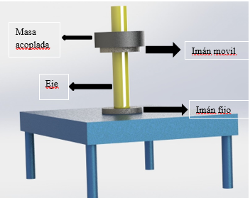

# Introduction to MagneticVibrations

In this proyect we found a model to describe a magnetic levitation system
We refear to two magnets continuously repelling each other in vertical position 

To better understand the system you can see a video of a dynamic response in the test.MP4 video

We analysed the different responses to the diferent values for the physical parameters as well as making a fequency analysis and linearization. We made a test in a lab with a laser to mesure the position of the levitating magnet to be able to validate the modle.

Please open the 'explanaition' pptx file to see the hole explanation and development of the entire project

the main project is in 'Proyecto_Vibratoria_Principal' in case you want to run it
